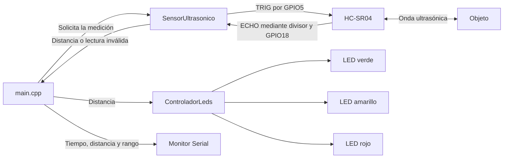
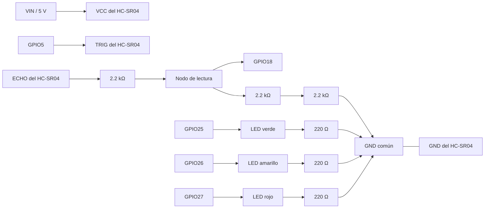
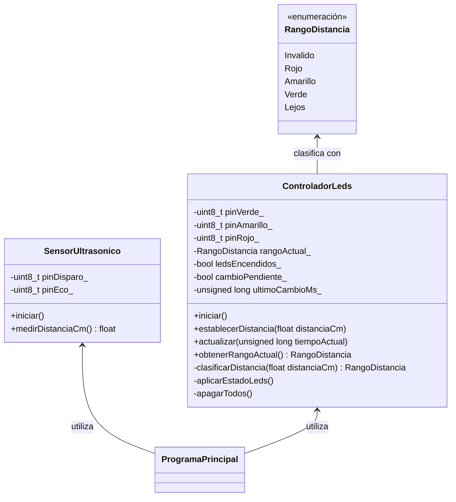
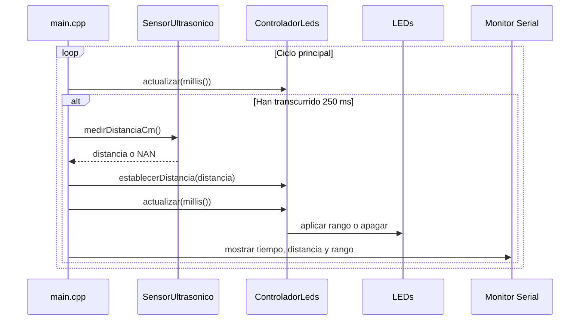

# Informe técnico — Práctica 1

**Actividad:** Integración de sensores y actuadores en un objeto inteligente  
**Asignatura:** SIS-234  
**Grupo:** 8  
**Plataforma:** ESP32 / ESP-WROOM-32

## Introducción

La práctica consiste en integrar un sensor, actuadores y un microcontrolador dentro de un objeto inteligente. El prototipo desarrollado utiliza un sensor ultrasónico HC-SR04 para medir la distancia a un objeto y tres LEDs para representar visualmente el rango detectado. El ESP32 procesa cada lectura, selecciona el rango correspondiente y mantiene el parpadeo de los LEDs sin detener el ciclo principal del programa.

Este documento presenta los requerimientos, el diseño de hardware y software, la implementación y el plan de pruebas. Los apartados cuantitativos se completarán únicamente después de realizar y registrar las mediciones reales.

## Objetivo general

Diseñar e implementar un sistema basado en ESP32 que mida distancias con un HC-SR04, clasifique las lecturas en rangos contiguos y controle tres LEDs de acuerdo con el rango detectado, mediante una solución modular, orientada a objetos y susceptible de validación experimental.

## Descripción del sistema

El HC-SR04 recibe un pulso de disparo del ESP32 y devuelve por ECHO un pulso cuya duración representa el tiempo de vuelo del sonido. El firmware convierte esa duración a centímetros y clasifica el resultado. Los LEDs rojo, amarillo y verde actúan como indicadores. Cuando la distancia supera 25 cm, los tres parpadean simultáneamente; si la lectura es inválida o se produce un timeout, todos permanecen apagados.

El pin ECHO del sensor opera a una tensión superior a la admitida directamente por el ESP32. Por ello se utiliza un divisor resistivo formado por una resistencia de 2.2 kΩ en la parte superior y dos resistencias de 2.2 kΩ en serie hacia tierra.

## 1. Requerimientos Funcionales y No Funcionales

### 1.1 Requerimientos funcionales

| Identificador | Requerimiento | Criterio de aceptación | Elemento responsable |
|---|---|---|---|
| RF1 | Medir la distancia entre el HC-SR04 y un objeto. | El sistema obtiene una lectura en centímetros aproximadamente cada 250 ms y la presenta por Serial cuando es válida. | `SensorUltrasonico` y `main.cpp` |
| RF2 | Clasificar cada distancia válida en rangos contiguos y sin solapamiento. | Toda distancia mayor que cero pertenece exactamente a uno de los cuatro rangos definidos. | `ControladorLeds` |
| RF3 | Controlar los LEDs de acuerdo con el rango detectado. | Se activa el patrón de parpadeo correspondiente de acuerdo con la tabla de rangos. | `ControladorLeds` |
| RF4 | Tratar claramente una lectura inválida. | Ante un timeout o una distancia no válida, se informa el estado por Serial y todos los LEDs permanecen apagados. | `SensorUltrasonico`, `ControladorLeds` y `main.cpp` |

### 1.2 Rangos y lógica de control

| Distancia medida | Rango interno | Comportamiento esperado |
|---|---|---|
| Lectura inválida o timeout | `Invalido` | Todos los LEDs apagados |
| 0 < distancia ≤ 5 cm | `Rojo` | LED rojo parpadeando |
| 5 < distancia ≤ 15 cm | `Amarillo` | LED amarillo parpadeando |
| 15 < distancia ≤ 25 cm | `Verde` | LED verde parpadeando |
| distancia > 25 cm | `Lejos` | Los tres LEDs parpadeando simultáneamente |

Los cuatro intervalos válidos son contiguos y no se solapan. Los valores 5, 15 y 25 cm se incluyen en el intervalo inferior correspondiente, tal como indican las desigualdades de la tabla.

### 1.3 Requerimientos no funcionales

| Identificador | Atributo | Requerimiento medible | Método previsto de verificación |
|---|---|---|---|
| RNF1 | Estabilidad | Operar al menos 10 minutos continuos sin reinicios ni bloqueos. | Observación del prototipo y registro continuo de la salida Serial. |
| RNF2 | Exactitud | Mantener un error máximo absoluto menor o igual a 3 cm respecto de una referencia física. | Comparación con una cinta métrica en varias distancias del rango de trabajo. |
| RNF3 | Tiempo de respuesta | Reflejar un cambio de rango en los actuadores en un tiempo menor o igual a 1 segundo. | Análisis lógico del intervalo de medición, el timeout máximo y el flujo no bloqueante. |
| RNF4 | Frecuencia de muestreo | Producir al menos 2 lecturas por segundo. | Cálculo lógico a partir del intervalo configurado y del escenario conservador con timeout. |
| RNF5 | Calidad del código | Mantener código legible, modular, orientado a objetos y documentado con comentarios breves y útiles. | Revisión de la estructura, nombres, responsabilidades y dependencias del código fuente. |

RNF1 y RNF2 requieren validación experimental documentada. RNF3 y RNF4 pueden justificarse lógicamente a partir del código y sus constantes de temporización, sin que esto constituya una medición física.

## 2. Análisis y Diseño

### 2.1 Análisis del problema

El sistema recibe una magnitud física —la distancia— y debe transformarla en una indicación visual fácil de interpretar. Para ello se distinguen cuatro etapas:

1. Generar el pulso de disparo del HC-SR04.
2. medir la duración del pulso ECHO y convertirla a centímetros;
3. clasificar la distancia o identificar una lectura inválida;
4. aplicar y actualizar el patrón visual correspondiente sin bloquear nuevas mediciones.

La separación entre medición y actuación evita mezclar responsabilidades. Además, el uso de tiempo transcurrido con `millis()` permite que el parpadeo avance mientras el programa continúa ejecutando el ciclo principal.

### 2.2 Diagrama de arquitectura del sistema



### 2.3 Diseño del circuito

#### 2.3.1 Conexiones

| Elemento | Conexión |
|---|---|
| HC-SR04 VCC | VIN / 5 V del ESP32 |
| HC-SR04 GND | GND común |
| HC-SR04 TRIG | GPIO5 |
| HC-SR04 ECHO | Divisor de voltaje y luego GPIO18 |
| LED verde | GPIO25 → LED verde → resistencia de 220 Ω → GND |
| LED amarillo | GPIO26 → LED amarillo → resistencia de 220 Ω → GND |
| LED rojo | GPIO27 → LED rojo → resistencia de 220 Ω → GND |

#### 2.3.2 Divisor de voltaje de ECHO

El divisor utiliza 2.2 kΩ entre ECHO y el nodo de lectura, y 4.4 kΩ —dos resistencias de 2.2 kΩ en serie— entre el nodo y GND. Su tensión ideal se calcula como:

```text
VGPIO18 = VECHO × 4.4 kΩ / (2.2 kΩ + 4.4 kΩ)
VGPIO18 = 5 V × 4.4 / 6.6 ≈ 3.33 V
```

Esta reducción adapta idealmente la señal de 5 V de ECHO al nivel lógico del ESP32.



El esquema vectorial detallado puede consultarse en [`docs/diagramas/circuito.svg`](docs/diagramas/circuito.svg).

### 2.4 Diseño estructural del software



`SensorUltrasonico` encapsula el acceso al dispositivo de entrada. `ControladorLeds` encapsula la clasificación, el estado del parpadeo y el acceso a los actuadores. `main.cpp` crea ambos objetos y coordina el intercambio de información.

### 2.5 Diseño de comportamiento



El controlador alterna el estado encendido/apagado cuando han transcurrido aproximadamente 150 ms. Si cambia el rango, apaga el estado anterior y aplica de inmediato el nuevo patrón en la siguiente actualización. Si el rango es inválido, fuerza los tres LEDs a nivel bajo.

## 3. Desarrollo e Implementación

### 3.1 Entorno de desarrollo

| Componente | Configuración |
|---|---|
| Plataforma de desarrollo | PlatformIO |
| Plataforma embebida | `espressif32` |
| Placa | `esp32doit-devkit-v1` |
| Entorno de trabajo | Arduino |
| Lenguaje | C++ |
| Velocidad del monitor Serial | 115200 baudios |
| Librerías externas añadidas | Ninguna |

### 3.2 Organización del código

| Archivo | Responsabilidad |
|---|---|
| `include/SensorUltrasonico.h` | Declarar la clase del sensor y su interfaz pública. |
| `src/SensorUltrasonico.cpp` | Inicializar TRIG/ECHO, generar el pulso, medir ECHO y convertirlo a centímetros. |
| `include/ControladorLeds.h` | Declarar los rangos y la interfaz del controlador de LEDs. |
| `src/ControladorLeds.cpp` | Clasificar la distancia y mantener el parpadeo no bloqueante. |
| `src/main.cpp` | Configurar los pines mediante objetos, programar las mediciones y emitir la información Serial. |

### 3.3 Medición ultrasónica

La clase `SensorUltrasonico` recibe los pines de disparo y eco mediante su constructor. `iniciar()` configura TRIG como salida, ECHO como entrada y deja TRIG en nivel bajo.

Para cada medición, `medirDistanciaCm()` mantiene TRIG en bajo durante 2 µs, genera un pulso alto de 10 µs y mide ECHO con `pulseIn()`. El timeout se fijó en 30000 µs. Si no se detecta un pulso dentro de ese intervalo, el método devuelve `NAN`, lo que distingue claramente un error de una distancia válida.

Cuando existe un pulso, la conversión utilizada es:

```text
distanciaCm = duraciónEcoUs × 0.0343 cm/µs ÷ 2
```

La división entre dos representa el recorrido de ida y vuelta del sonido.

### 3.4 Clasificación y control de LEDs

`ControladorLeds` recibe los tres pines mediante su constructor. La enumeración `RangoDistancia` representa los estados `Invalido`, `Rojo`, `Amarillo`, `Verde` y `Lejos`. El método privado `clasificarDistancia()` aplica los límites de 5, 15 y 25 cm.

`establecerDistancia()` solo reinicia el patrón cuando cambia el rango. Esto evita alterar el parpadeo en cada nueva muestra. Ante un valor no finito o menor o igual que cero, selecciona `Invalido` y apaga todos los LEDs.

### 3.5 Parpadeo no bloqueante

El método `actualizar()` compara el tiempo recibido con `ultimoCambioMs_`. Cuando transcurren 150 ms, alterna `ledsEncendidos_` y aplica el estado correspondiente. No se utiliza `delay()` para el parpadeo, por lo que el ciclo principal puede continuar atendiendo la planificación de mediciones y la salida Serial. Los únicos retardos breves son los microsegundos necesarios para formar el pulso TRIG.

### 3.6 Coordinación y salida Serial

`main.cpp` crea un objeto `SensorUltrasonico` y un objeto `ControladorLeds` con los pines definidos como constantes. `setup()` inicia Serial y ambos objetos. En `loop()` se actualiza continuamente el controlador y se realiza una medición cuando han transcurrido 250 ms desde la anterior.

Cada registro Serial sigue uno de estos formatos:

```text
Tiempo: <tiempo> ms | Distancia: <distancia> cm | Rango: <rango>
Tiempo: <tiempo> ms | Lectura invalida | Rango: Invalido
```

El intervalo configurado corresponde nominalmente a cuatro lecturas por segundo. Las secciones 4.5 y 4.6 justifican lógicamente el tiempo de respuesta y la frecuencia de muestreo mediante un escenario conservador que también considera el timeout máximo de `pulseIn()`.

### 3.7 Buenas prácticas aplicadas

- Separación de responsabilidades mediante dos clases pequeñas.
- Encapsulación de pines y estados internos.
- Constantes con nombres descriptivos para pines, límites e intervalos.
- Rangos representados mediante `enum class`.
- Cálculos de tiempo compatibles con el desbordamiento de `millis()` mediante resta sin signo.
- Ausencia de asignación dinámica, herencia, tareas adicionales y librerías innecesarias.
- Tratamiento explícito del timeout y de las lecturas inválidas.

## 4. Pruebas y Validaciones

Esta sección documenta las pruebas funcionales, de exactitud y de estabilidad realizadas. El tiempo de respuesta y la frecuencia de muestreo se validan lógicamente a partir del diseño del firmware y se mantienen identificadas como análisis teóricos, no como mediciones físicas.

### 4.1 Datos generales de la sesión de pruebas

| Campo | Valor registrado |
|---|---|
| Fecha y hora | 14/09/2026 |
| Integrantes responsables | Grupo 8: Santiago Javier Torres Vacaflores y Ariel Adrian Mercado Alegre |
| Versión o commit del firmware | `a2c95c3` |
| Alimentación utilizada | ESP32 alimentado mediante USB desde la computadora |
| Instrumento de referencia | Regla graduada en centímetros |
| Condiciones y observaciones del ambiente | Prueba realizada en un ambiente interior, con el circuito colocado sobre una superficie estable; las distancias se tomaron desde la cara frontal de los transductores del HC-SR04 hasta el objeto de referencia. |
| Primer timestamp registrado | 142752 ms |
| Último timestamp registrado | 1298003 ms |
| Duración calculada | 1155251 ms (19 min 15.251 s) |

### 4.2 Validación funcional de rangos y actuadores

Se probaron distancias dentro de los cuatro rangos, incluidos los límites exactos de 5, 15 y 25 cm. En todos los casos el rango observado y el comportamiento físico coincidieron con lo esperado.

| Caso | Distancia de referencia | Rango esperado | Distancia promedio observada | Rango observado | Comportamiento físico observado | Evaluación |
|---|---:|---|---:|---|---|---|
| PF-01 | Sin eco válido | `Invalido` | No aplicable | `Invalido` | Los tres LEDs permanecieron apagados | **APROBADA** |
| PF-02 | 3 cm | `Rojo` | 3.310 cm | `Rojo` | Correcto | **APROBADA** |
| PF-03 | 5 cm | `Rojo` | 4.944 cm | `Rojo` | Correcto | **APROBADA** |
| PF-04 | 6 cm | `Amarillo` | 6.252 cm | `Amarillo` | Correcto | **APROBADA** |
| PF-05 | 10 cm | `Amarillo` | 10.630 cm | `Amarillo` | Correcto | **APROBADA** |
| PF-06 | 15 cm | `Amarillo` | 14.750 cm | `Amarillo` | Correcto | **APROBADA** |
| PF-07 | 16 cm | `Verde` | 16.120 cm | `Verde` | Correcto | **APROBADA** |
| PF-08 | 20 cm | `Verde` | 19.992 cm | `Verde` | Correcto | **APROBADA** |
| PF-09 | 25 cm | `Verde` | 24.610 cm | `Verde` | Correcto | **APROBADA** |
| PF-10 | 30 cm | `Lejos` | 29.812 cm | `Lejos` | Los tres LEDs parpadearon simultáneamente | **APROBADA** |

Para PF-01 se apuntó el HC-SR04 hacia el techo con el fin de provocar ausencia de un eco válido dentro del timeout configurado. El monitor Serial mostró repetidamente:

```text
Tiempo: 20530 ms | Lectura invalida | Rango: Invalido
Tiempo: 20780 ms | Lectura invalida | Rango: Invalido
Tiempo: 21030 ms | Lectura invalida | Rango: Invalido
Tiempo: 21280 ms | Lectura invalida | Rango: Invalido
Tiempo: 21530 ms | Lectura invalida | Rango: Invalido
Tiempo: 21780 ms | Lectura invalida | Rango: Invalido
Tiempo: 22030 ms | Lectura invalida | Rango: Invalido
Tiempo: 22280 ms | Lectura invalida | Rango: Invalido
```

Durante estas lecturas los tres LEDs permanecieron apagados, el sistema continuó ejecutándose normalmente y no hubo reinicios ni bloqueos. Por ello, la prueba funcional de lectura inválida, timeout y apagado de actuadores queda **APROBADA**.

### 4.3 Validación de exactitud

Para cada distancia se registraron cinco lecturas. El error máximo absoluto de cada grupo corresponde al mayor valor de la diferencia absoluta entre una lectura y su referencia:

```text
error = distancia medida - distancia de referencia
error máximo absoluto = máximo de |error|
```

El criterio declarado es un error máximo absoluto ≤ 3 cm.

| Referencia | Lecturas registradas (cm) | Mínimo | Máximo | Promedio | Error máximo absoluto | Evaluación |
|---:|---|---:|---:|---:|---:|---|
| 3 cm | 3.31, 3.31, 3.31, 3.31, 3.31 | 3.31 cm | 3.31 cm | 3.310 cm | 0.31 cm | **APROBADA** |
| 5 cm | 4.94, 4.94, 4.96, 4.94, 4.94 | 4.94 cm | 4.96 cm | 4.944 cm | 0.06 cm | **APROBADA** |
| 6 cm | 6.24, 6.24, 6.26, 6.26, 6.26 | 6.24 cm | 6.26 cm | 6.252 cm | 0.26 cm | **APROBADA** |
| 10 cm | 10.63, 10.63, 10.63, 10.63, 10.63 | 10.63 cm | 10.63 cm | 10.630 cm | 0.63 cm | **APROBADA** |
| 15 cm | 14.75, 14.75, 14.75, 14.75, 14.75 | 14.75 cm | 14.75 cm | 14.750 cm | 0.25 cm | **APROBADA** |
| 16 cm | 16.12, 16.12, 16.12, 16.12, 16.12 | 16.12 cm | 16.12 cm | 16.120 cm | 0.12 cm | **APROBADA** |
| 20 cm | 19.98, 20.00, 20.00, 20.00, 19.98 | 19.98 cm | 20.00 cm | 19.992 cm | 0.02 cm | **APROBADA** |
| 25 cm | 24.61, 24.61, 24.61, 24.61, 24.61 | 24.61 cm | 24.61 cm | 24.610 cm | 0.39 cm | **APROBADA** |
| 30 cm | 29.81, 29.81, 29.81, 29.82, 29.81 | 29.81 cm | 29.82 cm | 29.812 cm | 0.19 cm | **APROBADA** |

Se analizaron 45 lecturas en total. La suma de sus errores absolutos es 11.02 cm, por lo que:

```text
error absoluto promedio = 11.02 cm / 45 ≈ 0.245 cm
```

- Error máximo absoluto global: **0.63 cm**, observado en las lecturas de referencia de 10 cm.
- Error absoluto promedio de todas las lecturas: **0.245 cm**.
- Criterio requerido: error máximo absoluto ≤ 3 cm.

El error máximo absoluto global es menor que el límite de 3 cm. Por tanto, la prueba de exactitud queda **APROBADA**.

### 4.4 Validación de estabilidad

Las pruebas de rangos y exactitud se realizaron durante la misma sesión continua del ESP32. La duración se obtuvo a partir del primer y último timestamp registrados:

```text
duración = 1298003 ms - 142752 ms
duración = 1155251 ms = 1155.251 s = 19 min 15.251 s
```

| Inicio | Fin | Duración total | Reinicios | Bloqueos | Continuidad de lecturas | Respuesta de LEDs | Fallos o interferencias observados | Evaluación |
|---:|---:|---:|---:|---:|---|---|---|---|
| 142752 ms | 1298003 ms | 1155251 ms (19 min 15.251 s) | 0 | 0 | El sensor continuó realizando lecturas | Los LEDs siguieron respondiendo correctamente | Ninguno | **APROBADA** |

La sesión superó los 10 minutos requeridos sin reinicios ni bloqueos. No se observaron fallos funcionales ni interferencias durante el proceso. Por tanto, la prueba de estabilidad queda **APROBADA**.

### 4.5 Validación del tiempo de respuesta

Esta validación es lógica y se basa en las constantes y el flujo del firmware; no representa una medición física. El caso conservador considera que el objeto cambia de rango justo después de una lectura. En ese instante puede esperar hasta un intervalo completo antes de la siguiente medición. A ello se suma el timeout máximo de `pulseIn()`:

```text
espera máxima hasta la siguiente medición = 250 ms
timeout máximo de pulseIn                 =  30 ms
tiempo teórico conservador                = 280 ms + procesamiento breve
```

| Elemento analizado | Valor máximo considerado |
|---|---:|
| Espera hasta la siguiente medición | 250 ms |
| Ejecución de `pulseIn()` | 30 ms |
| Base del peor caso teórico conservador | 280 ms |
| Criterio requerido | 1000 ms |

Después de obtener la lectura, `main.cpp` entrega inmediatamente la distancia al `ControladorLeds` y llama a `actualizar()`. El parpadeo no utiliza `delay()`, por lo que no introduce una espera bloqueante adicional. El procesamiento restante es pequeño frente al margen aproximado de 720 ms entre la base conservadora y el límite requerido.

Por tanto, el diseño cumple lógicamente el requisito de tiempo de respuesta ≤ 1 segundo. Esta conclusión se limita al análisis del código y no afirma que se haya efectuado una medición física del tiempo de respuesta.

**Evaluación: APROBADA mediante validación lógica del diseño, no mediante medición física.**

### 4.6 Validación de la frecuencia de muestreo

La frecuencia nominal se obtiene directamente del intervalo de medición configurado:

```text
frecuencia nominal = 1 / 0.250 s = 4 lecturas/s
```

Como escenario conservador, se suma el timeout máximo de 30 ms al intervalo configurado:

```text
intervalo conservador = 0.250 s + 0.030 s = 0.280 s
frecuencia conservadora = 1 / 0.280 s ≈ 3.57 lecturas/s
```

| Escenario lógico | Intervalo considerado | Frecuencia calculada | Requisito |
|---|---:|---:|---:|
| Nominal | 250 ms | 4 lecturas/s | ≥ 2 lecturas/s |
| Conservador con timeout máximo | 280 ms | ≈ 3.57 lecturas/s | ≥ 2 lecturas/s |

Ambos valores superan el mínimo requerido. Por tanto, el diseño cumple lógicamente el requisito de frecuencia de muestreo ≥ 2 lecturas/s. Esta es una justificación matemática basada en el código, no un resultado experimental.

**Evaluación: APROBADA mediante validación lógica del diseño, no mediante medición física.**

La captura Serial puede utilizarse como evidencia complementaria para observar el comportamiento real, pero no es necesaria para justificar matemáticamente el diseño:

| Inicio del registro | Fin del registro | Duración | Cantidad de lecturas | Intervalo promedio | Frecuencia observada | Evidencia |
|---|---|---:|---:|---:|---:|---|
| | | | | | | |


### 4.7 Control de evidencias

Los datos numéricos y los fragmentos de salida Serial se incorporaron directamente en las secciones 4.2 a 4.4. Las evidencias disponibles son:

- [PDF de pruebas de rangos, exactitud y lectura inválida](<docs/evidencias/Pruebas de rangos.pdf>).
- [Fotografía general del prototipo](docs/evidencias/prototipo.jpeg).
- [Fotografía del LED rojo](docs/evidencias/led-rojo.jpeg).
- [Fotografía del LED amarillo](docs/evidencias/led-amarillo.jpeg).
- [Fotografía del LED verde](docs/evidencias/led-verde.jpeg).
- [Fotografía de los tres LEDs](docs/evidencias/tres-colores-leds.jpeg).

La descripción y relación de cada archivo con las pruebas se encuentra en [`docs/evidencias/README.md`](docs/evidencias/README.md).

## 5. Resultados

Las pruebas realizadas respaldan el funcionamiento de los rangos, el tratamiento de lecturas inválidas, la exactitud y la estabilidad. El tiempo de respuesta y la frecuencia de muestreo se respaldan mediante validaciones lógicas del diseño y no deben interpretarse como mediciones físicas.

| Aspecto | Objetivo | Resultado | Evaluación |
|---|---|---|---|
| Comportamiento de rangos | Coincidir con la lógica definida en RF2 y RF3 | Los rangos observados y el comportamiento físico coincidieron en 3, 5, 6, 10, 15, 16, 20, 25 y 30 cm | **APROBADA** |
| Lectura inválida | Informar `Invalido` y mantener apagados los tres LEDs | Ocho registros consecutivos inválidos; LEDs apagados y ejecución normal | **APROBADA** |
| Estabilidad | ≥ 10 minutos sin reinicios ni bloqueos | Desde 142752 ms hasta 1298003 ms: 1155251 ms (19 min 15.251 s) continuos, sin reinicios, bloqueos, fallos ni interferencias observados | **APROBADA** |
| Exactitud | Error máximo absoluto ≤ 3 cm | Error máximo global de 0.63 cm y error absoluto promedio de 0.245 cm sobre 45 lecturas | **APROBADA** |
| Tiempo de respuesta | ≤ 1 segundo | ≈ 280 ms más procesamiento breve en el peor caso teórico conservador | **APROBADA mediante validación lógica; sin medición física** |
| Frecuencia de muestreo | ≥ 2 lecturas/s | 4 lecturas/s nominales y ≈ 3.57 lecturas/s en el escenario conservador | **APROBADA mediante validación lógica; sin medición física** |

## 6. Conclusiones

Las pruebas funcionales confirmaron la clasificación y el comportamiento físico esperado en los cuatro rangos, incluidos los límites de 5, 15 y 25 cm. También se comprobó que, ante la ausencia de un eco válido, el sistema informa el rango `Invalido`, mantiene apagados los tres LEDs y continúa ejecutándose sin reinicios ni bloqueos.

En las 45 lecturas de exactitud, el error máximo absoluto global fue 0.63 cm y el error absoluto promedio fue aproximadamente 0.245 cm. Ambos resultados respaldan el cumplimiento del criterio de error máximo absoluto ≤ 3 cm para las distancias probadas.

La sesión continua comenzó en el timestamp 142752 ms y terminó en 1298003 ms. La diferencia fue 1155251 ms, equivalente a 19 min 15.251 s, sin reinicios, bloqueos, fallos funcionales ni interferencias observadas; por tanto, cumplió el mínimo de 10 minutos declarado para estabilidad.

El diseño satisface lógicamente los requisitos de tiempo de respuesta y frecuencia de muestreo: el peor caso teórico conservador es de aproximadamente 280 ms más procesamiento breve, y las frecuencias calculadas son 4 lecturas/s en el caso nominal y aproximadamente 3.57 lecturas/s en el conservador. Estas dos conclusiones son teóricas y no constituyen mediciones físicas.

## 7. Recomendaciones

- Conservar los datos originales de las lecturas y los registros Serial junto con la versión del firmware utilizada.
- Repetir las pruebas de estabilidad y exactitud si se modifica el hardware, el montaje o el firmware.
- Mantener sin filtros ni calibraciones adicionales mientras los resultados continúen dentro del criterio; cualquier cambio futuro debe justificarse con nuevas mediciones.
- Registrar el instrumento de referencia y las condiciones de la sesión en futuras repeticiones para mejorar la reproducibilidad.
- Utilizar una captura Serial como comprobación complementaria de la frecuencia observada, manteniendo separada esa evidencia de la validación matemática actual.
- Realizar una medición física del tiempo de respuesta si se desea complementar el límite demostrado lógicamente por el diseño.

## 8. Anexos

### Anexo A. Código fuente

- [`src/main.cpp`](src/main.cpp)
- [`include/SensorUltrasonico.h`](include/SensorUltrasonico.h)
- [`src/SensorUltrasonico.cpp`](src/SensorUltrasonico.cpp)
- [`include/ControladorLeds.h`](include/ControladorLeds.h)
- [`src/ControladorLeds.cpp`](src/ControladorLeds.cpp)
- [`platformio.ini`](platformio.ini)

### Anexo B. Diagramas

Los diagramas iniciales están incluidos en la sección 2 mediante Mermaid. El esquema vectorial detallado del cableado está disponible en [`docs/diagramas/circuito.svg`](docs/diagramas/circuito.svg).

### Anexo C. Evidencias

Las evidencias reales se encuentran en [`docs/evidencias/`](docs/evidencias/) y se describen en su [índice de evidencias](docs/evidencias/README.md).

### Anexo D. Consigna

La consigna original está disponible en [`docs/consigna/Practica_1.md`](docs/consigna/Practica_1.md).
