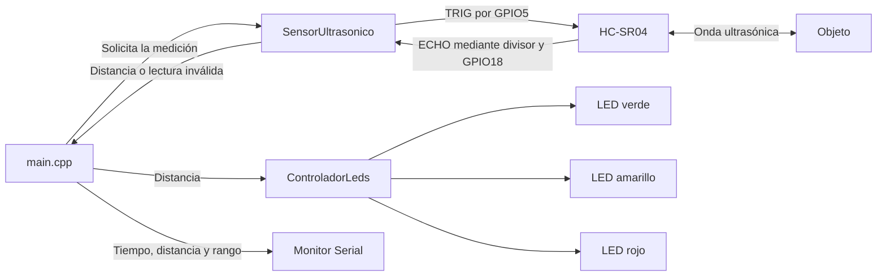
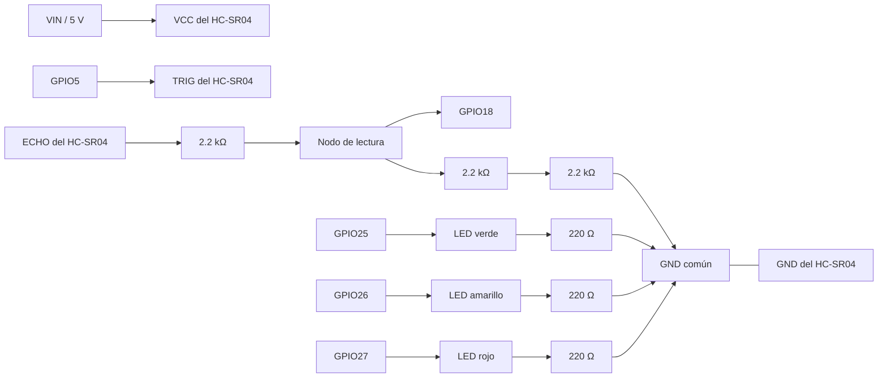
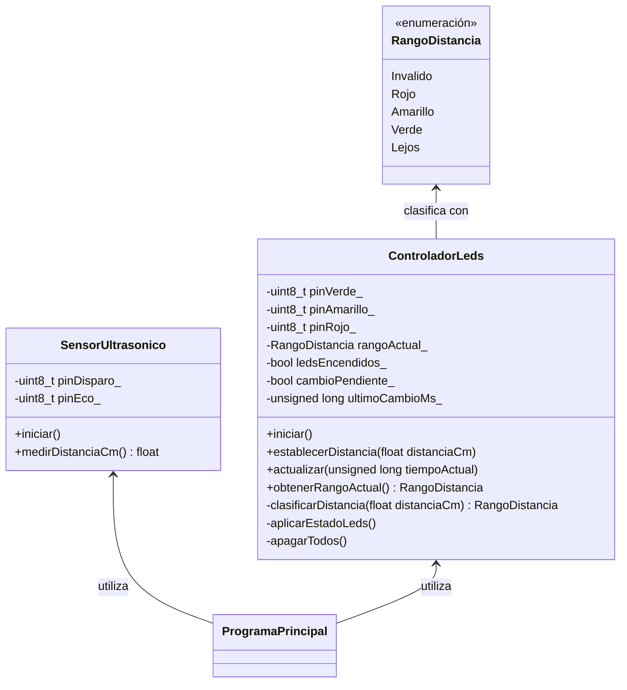
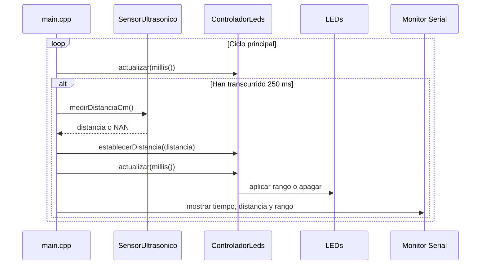

# Informe técnico — Práctica 1

**Actividad:** Integración de sensores y actuadores en un objeto inteligente  
**Asignatura:** SIS-234  
**Grupo:** 8  
**Plataforma:** ESP32 / ESP-WROOM-32

## Introducción

La práctica consiste en integrar un sensor, actuadores y un microcontrolador dentro de un objeto inteligente. El prototipo desarrollado utiliza un sensor ultrasónico HC-SR04 para medir la distancia a un objeto y tres LEDs para representar visualmente el rango detectado. El ESP32 procesa cada lectura, selecciona el rango correspondiente y mantiene el parpadeo de los LEDs sin detener el ciclo principal del programa.

Este documento presenta los requerimientos, el diseño de hardware y software, la implementación y el plan de pruebas. Los apartados cuantitativos se completarán únicamente después de realizar y registrar las mediciones reales.

## Objetivo general

Diseñar e implementar un sistema basado en ESP32 que mida distancias con un HC-SR04, clasifique las lecturas en rangos contiguos y controle tres LEDs de acuerdo con el rango detectado, mediante una solución modular, orientada a objetos y susceptible de validación experimental.

## Descripción del sistema

El HC-SR04 recibe un pulso de disparo del ESP32 y devuelve por ECHO un pulso cuya duración representa el tiempo de vuelo del sonido. El firmware convierte esa duración a centímetros y clasifica el resultado. Los LEDs rojo, amarillo y verde actúan como indicadores. Cuando la distancia supera 25 cm, los tres parpadean simultáneamente; si la lectura es inválida o se produce un timeout, todos permanecen apagados.

El pin ECHO del sensor opera a una tensión superior a la admitida directamente por el ESP32. Por ello se utiliza un divisor resistivo formado por una resistencia de 2.2 kΩ en la parte superior y dos resistencias de 2.2 kΩ en serie hacia tierra.

## 1. Requerimientos Funcionales y No Funcionales

### 1.1 Requerimientos funcionales

| Identificador | Requerimiento | Criterio de aceptación | Elemento responsable |
|---|---|---|---|
| RF1 | Medir la distancia entre el HC-SR04 y un objeto. | El sistema obtiene una lectura en centímetros aproximadamente cada 250 ms y la presenta por Serial cuando es válida. | `SensorUltrasonico` y `main.cpp` |
| RF2 | Clasificar cada distancia válida en rangos contiguos y sin solapamiento. | Toda distancia mayor que cero pertenece exactamente a uno de los cuatro rangos definidos. | `ControladorLeds` |
| RF3 | Controlar los LEDs de acuerdo con el rango detectado. | Se activa el patrón de parpadeo correspondiente de acuerdo con la tabla de rangos. | `ControladorLeds` |
| RF4 | Tratar claramente una lectura inválida. | Ante un timeout o una distancia no válida, se informa el estado por Serial y todos los LEDs permanecen apagados. | `SensorUltrasonico`, `ControladorLeds` y `main.cpp` |

### 1.2 Rangos y lógica de control

| Distancia medida | Rango interno | Comportamiento esperado |
|---|---|---|
| Lectura inválida o timeout | `Invalido` | Todos los LEDs apagados |
| 0 < distancia ≤ 5 cm | `Rojo` | LED rojo parpadeando |
| 5 < distancia ≤ 15 cm | `Amarillo` | LED amarillo parpadeando |
| 15 < distancia ≤ 25 cm | `Verde` | LED verde parpadeando |
| distancia > 25 cm | `Lejos` | Los tres LEDs parpadeando simultáneamente |

Los cuatro intervalos válidos son contiguos y no se solapan. Los valores 5, 15 y 25 cm se incluyen en el intervalo inferior correspondiente, tal como indican las desigualdades de la tabla.

### 1.3 Requerimientos no funcionales

| Identificador | Atributo | Requerimiento medible | Método previsto de verificación |
|---|---|---|---|
| RNF1 | Estabilidad | Operar al menos 10 minutos continuos sin reinicios ni bloqueos. | Observación del prototipo y registro continuo de la salida Serial. |
| RNF2 | Exactitud | Mantener un error máximo absoluto menor o igual a 3 cm respecto de una referencia física. | Comparación con una cinta métrica en varias distancias del rango de trabajo. |
| RNF3 | Tiempo de respuesta | Reflejar un cambio de rango en los actuadores en un tiempo menor o igual a 1 segundo. | Análisis lógico del intervalo de medición, el timeout máximo y el flujo no bloqueante. |
| RNF4 | Frecuencia de muestreo | Producir al menos 2 lecturas por segundo. | Cálculo lógico a partir del intervalo configurado y del escenario conservador con timeout. |
| RNF5 | Calidad del código | Mantener código legible, modular, orientado a objetos y documentado con comentarios breves y útiles. | Revisión de la estructura, nombres, responsabilidades y dependencias del código fuente. |

RNF1 y RNF2 requieren validación experimental documentada. RNF3 y RNF4 pueden justificarse lógicamente a partir del código y sus constantes de temporización, sin que esto constituya una medición física.

## 2. Análisis y Diseño

### 2.1 Análisis del problema

El sistema recibe una magnitud física —la distancia— y debe transformarla en una indicación visual fácil de interpretar. Para ello se distinguen cuatro etapas:

1. Generar el pulso de disparo del HC-SR04.
2. medir la duración del pulso ECHO y convertirla a centímetros;
3. clasificar la distancia o identificar una lectura inválida;
4. aplicar y actualizar el patrón visual correspondiente sin bloquear nuevas mediciones.

La separación entre medición y actuación evita mezclar responsabilidades. Además, el uso de tiempo transcurrido con `millis()` permite que el parpadeo avance mientras el programa continúa ejecutando el ciclo principal.

### 2.2 Diagrama de arquitectura del sistema



### 2.3 Diseño del circuito

#### 2.3.1 Conexiones

| Elemento | Conexión |
|---|---|
| HC-SR04 VCC | VIN / 5 V del ESP32 |
| HC-SR04 GND | GND común |
| HC-SR04 TRIG | GPIO5 |
| HC-SR04 ECHO | Divisor de voltaje y luego GPIO18 |
| LED verde | GPIO25 → LED verde → resistencia de 220 Ω → GND |
| LED amarillo | GPIO26 → LED amarillo → resistencia de 220 Ω → GND |
| LED rojo | GPIO27 → LED rojo → resistencia de 220 Ω → GND |

#### 2.3.2 Divisor de voltaje de ECHO

El divisor utiliza 2.2 kΩ entre ECHO y el nodo de lectura, y 4.4 kΩ —dos resistencias de 2.2 kΩ en serie— entre el nodo y GND. Su tensión ideal se calcula como:

```text
VGPIO18 = VECHO × 4.4 kΩ / (2.2 kΩ + 4.4 kΩ)
VGPIO18 = 5 V × 4.4 / 6.6 ≈ 3.33 V
```

Esta reducción adapta idealmente la señal de 5 V de ECHO al nivel lógico del ESP32.



El esquema vectorial detallado puede consultarse en [`docs/diagramas/circuito.svg`](docs/diagramas/circuito.svg).

### 2.4 Diseño estructural del software



`SensorUltrasonico` encapsula el acceso al dispositivo de entrada. `ControladorLeds` encapsula la clasificación, el estado del parpadeo y el acceso a los actuadores. `main.cpp` crea ambos objetos y coordina el intercambio de información.

### 2.5 Diseño de comportamiento



El controlador alterna el estado encendido/apagado cuando han transcurrido aproximadamente 150 ms. Si cambia el rango, apaga el estado anterior y aplica de inmediato el nuevo patrón en la siguiente actualización. Si el rango es inválido, fuerza los tres LEDs a nivel bajo.

## 3. Desarrollo e Implementación

### 3.1 Entorno de desarrollo

| Componente | Configuración |
|---|---|
| Plataforma de desarrollo | PlatformIO |
| Plataforma embebida | `espressif32` |
| Placa | `esp32doit-devkit-v1` |
| Entorno de trabajo | Arduino |
| Lenguaje | C++ |
| Velocidad del monitor Serial | 115200 baudios |
| Librerías externas añadidas | Ninguna |

### 3.2 Organización del código

| Archivo | Responsabilidad |
|---|---|
| `include/SensorUltrasonico.h` | Declarar la clase del sensor y su interfaz pública. |
| `src/SensorUltrasonico.cpp` | Inicializar TRIG/ECHO, generar el pulso, medir ECHO y convertirlo a centímetros. |
| `include/ControladorLeds.h` | Declarar los rangos y la interfaz del controlador de LEDs. |
| `src/ControladorLeds.cpp` | Clasificar la distancia y mantener el parpadeo no bloqueante. |
| `src/main.cpp` | Configurar los pines mediante objetos, programar las mediciones y emitir la información Serial. |

### 3.3 Medición ultrasónica

La clase `SensorUltrasonico` recibe los pines de disparo y eco mediante su constructor. `iniciar()` configura TRIG como salida, ECHO como entrada y deja TRIG en nivel bajo.

Para cada medición, `medirDistanciaCm()` mantiene TRIG en bajo durante 2 µs, genera un pulso alto de 10 µs y mide ECHO con `pulseIn()`. El timeout se fijó en 30000 µs. Si no se detecta un pulso dentro de ese intervalo, el método devuelve `NAN`, lo que distingue claramente un error de una distancia válida.

Cuando existe un pulso, la conversión utilizada es:

```text
distanciaCm = duraciónEcoUs × 0.0343 cm/µs ÷ 2
```

La división entre dos representa el recorrido de ida y vuelta del sonido.

### 3.4 Clasificación y control de LEDs

`ControladorLeds` recibe los tres pines mediante su constructor. La enumeración `RangoDistancia` representa los estados `Invalido`, `Rojo`, `Amarillo`, `Verde` y `Lejos`. El método privado `clasificarDistancia()` aplica los límites de 5, 15 y 25 cm.

`establecerDistancia()` solo reinicia el patrón cuando cambia el rango. Esto evita alterar el parpadeo en cada nueva muestra. Ante un valor no finito o menor o igual que cero, selecciona `Invalido` y apaga todos los LEDs.

### 3.5 Parpadeo no bloqueante

El método `actualizar()` compara el tiempo recibido con `ultimoCambioMs_`. Cuando transcurren 150 ms, alterna `ledsEncendidos_` y aplica el estado correspondiente. No se utiliza `delay()` para el parpadeo, por lo que el ciclo principal puede continuar atendiendo la planificación de mediciones y la salida Serial. Los únicos retardos breves son los microsegundos necesarios para formar el pulso TRIG.

### 3.6 Coordinación y salida Serial

`main.cpp` crea un objeto `SensorUltrasonico` y un objeto `ControladorLeds` con los pines definidos como constantes. `setup()` inicia Serial y ambos objetos. En `loop()` se actualiza continuamente el controlador y se realiza una medición cuando han transcurrido 250 ms desde la anterior.

Cada registro Serial sigue uno de estos formatos:

```text
Tiempo: <tiempo> ms | Distancia: <distancia> cm | Rango: <rango>
Tiempo: <tiempo> ms | Lectura invalida | Rango: Invalido
```

El intervalo configurado corresponde nominalmente a cuatro lecturas por segundo. Las secciones 4.5 y 4.6 justifican lógicamente el tiempo de respuesta y la frecuencia de muestreo mediante un escenario conservador que también considera el timeout máximo de `pulseIn()`.

### 3.7 Buenas prácticas aplicadas

- Separación de responsabilidades mediante dos clases pequeñas.
- Encapsulación de pines y estados internos.
- Constantes con nombres descriptivos para pines, límites e intervalos.
- Rangos representados mediante `enum class`.
- Cálculos de tiempo compatibles con el desbordamiento de `millis()` mediante resta sin signo.
- Ausencia de asignación dinámica, herencia, tareas adicionales y librerías innecesarias.
- Tratamiento explícito del timeout y de las lecturas inválidas.

## 4. Pruebas y Validaciones

Esta sección define cómo se comprobarán los requerimientos. Las tablas experimentales se encuentran preparadas para registrar datos reales y ninguna se considera aprobada en esta versión. El tiempo de respuesta y la frecuencia de muestreo se analizan además mediante validaciones lógicas basadas en el diseño del firmware.

### 4.1 Datos generales de la sesión de pruebas

| Campo | Valor registrado |
|---|---|
| Fecha y hora | |
| Integrantes responsables | |
| Versión o commit del firmware | |
| Alimentación utilizada | |
| Instrumento de referencia | |
| Condiciones y observaciones del ambiente | |

### 4.2 Validación funcional de rangos y actuadores

Se colocará un objeto plano a las distancias de referencia indicadas. Se observará el rango informado por Serial y el patrón físico de los LEDs. Los casos límite se medirán con especial cuidado.

| Caso | Distancia de referencia | Rango esperado | Comportamiento esperado | Distancia observada | Rango observado | Comportamiento observado | Evidencia | Evaluación |
|---|---:|---|---|---:|---|---|---|---|
| PF-01 | Sin eco válido | `Invalido` | Todos apagados | | | | | |
| PF-02 | 3 cm | `Rojo` | Parpadea rojo | | | | | |
| PF-03 | 5 cm | `Rojo` | Parpadea rojo | | | | | |
| PF-04 | 6 cm | `Amarillo` | Parpadea amarillo | | | | | |
| PF-05 | 15 cm | `Amarillo` | Parpadea amarillo | | | | | |
| PF-06 | 16 cm | `Verde` | Parpadea verde | | | | | |
| PF-07 | 25 cm | `Verde` | Parpadea verde | | | | | |
| PF-08 | 30 cm | `Lejos` | Parpadean los tres | | | | | |

### 4.3 Validación de exactitud

Para cada distancia se registrarán varias lecturas con el objeto y el sensor inmóviles. Se calcularán el error de cada lectura y el error máximo absoluto:

```text
error = distancia medida - distancia de referencia
error máximo absoluto = máximo de |error|
```

El criterio declarado es un error máximo absoluto ≤ 3 cm.

| Distancia de referencia | Número de lecturas | Distancia mínima | Distancia máxima | Promedio | Error máximo absoluto | Evidencia | Evaluación |
|---:|---:|---:|---:|---:|---:|---|---|
| | | | | | | | |
| | | | | | | | |
| | | | | | | | |
| | | | | | | | |
| | | | | | | | |

### 4.4 Validación de estabilidad

Se mantendrá el prototipo funcionando y registrando datos de forma continua durante un mínimo de 10 minutos. Se documentarán cualquier reinicio, bloqueo, interrupción de lecturas o comportamiento anómalo.

| Inicio | Fin | Duración total | Lecturas registradas | Reinicios | Bloqueos | Incidencias | Evidencia | Evaluación |
|---|---|---:|---:|---:|---:|---|---|---|
| | | | | | | | | |

### 4.5 Validación del tiempo de respuesta

Esta validación es lógica y se basa en las constantes y el flujo del firmware; no representa una medición física. El caso conservador considera que el objeto cambia de rango justo después de una lectura. En ese instante puede esperar hasta un intervalo completo antes de la siguiente medición. A ello se suma el timeout máximo de `pulseIn()`:

```text
espera máxima hasta la siguiente medición = 250 ms
timeout máximo de pulseIn                 =  30 ms
tiempo teórico conservador                = 280 ms + procesamiento breve
```

| Elemento analizado | Valor máximo considerado |
|---|---:|
| Espera hasta la siguiente medición | 250 ms |
| Ejecución de `pulseIn()` | 30 ms |
| Base del peor caso teórico conservador | 280 ms |
| Criterio requerido | 1000 ms |

Después de obtener la lectura, `main.cpp` entrega inmediatamente la distancia al `ControladorLeds` y llama a `actualizar()`. El parpadeo no utiliza `delay()`, por lo que no introduce una espera bloqueante adicional. El procesamiento restante es pequeño frente al margen aproximado de 720 ms entre la base conservadora y el límite requerido.

Por tanto, el diseño cumple lógicamente el requisito de tiempo de respuesta ≤ 1 segundo. Esta conclusión se limita al análisis del código y no afirma que se haya efectuado una medición física del tiempo de respuesta.

### 4.6 Validación de la frecuencia de muestreo

La frecuencia nominal se obtiene directamente del intervalo de medición configurado:

```text
frecuencia nominal = 1 / 0.250 s = 4 lecturas/s
```

Como escenario conservador, se suma el timeout máximo de 30 ms al intervalo configurado:

```text
intervalo conservador = 0.250 s + 0.030 s = 0.280 s
frecuencia conservadora = 1 / 0.280 s ≈ 3.57 lecturas/s
```

| Escenario lógico | Intervalo considerado | Frecuencia calculada | Requisito |
|---|---:|---:|---:|
| Nominal | 250 ms | 4 lecturas/s | ≥ 2 lecturas/s |
| Conservador con timeout máximo | 280 ms | ≈ 3.57 lecturas/s | ≥ 2 lecturas/s |

Ambos valores superan el mínimo requerido. Por tanto, el diseño cumple lógicamente el requisito de frecuencia de muestreo ≥ 2 lecturas/s. Esta es una justificación matemática basada en el código, no un resultado experimental.

La captura Serial puede utilizarse como evidencia complementaria para observar el comportamiento real, pero no es necesaria para justificar matemáticamente el diseño:

| Inicio del registro | Fin del registro | Duración | Cantidad de lecturas | Intervalo promedio | Frecuencia observada | Evidencia |
|---|---|---:|---:|---:|---:|---|
| | | | | | | |


### 4.7 Control de evidencias

Las fotografías, videos, capturas y registros se almacenarán en `docs/evidencias/`. Cada referencia escrita en las tablas deberá coincidir con un archivo identificable dentro de esa carpeta. Las reglas de organización se describen en `docs/evidencias/README.md`.

## 5. Resultados

Los resultados experimentales están pendientes de completar con mediciones reales y evidencias reproducibles. La existencia del prototipo funcional ha sido informada por el equipo, pero esta versión todavía no incorpora registros experimentales. El tiempo de respuesta y la frecuencia de muestreo sí cuentan con una validación lógica del diseño, separada de cualquier medición física.

| Aspecto | Objetivo | Resultado medido | Evaluación |
|---|---|---|---|
| Comportamiento de rangos | Coincidir con la lógica definida en RF2 y RF3 | Pendiente de documentar | No evaluado |
| Estabilidad | ≥ 10 minutos sin reinicios ni bloqueos | Pendiente de medición | No evaluado |
| Exactitud | Error máximo absoluto ≤ 3 cm | Pendiente de medición | No evaluado |
| Tiempo de respuesta | ≤ 1 segundo | ≈ 280 ms más procesamiento breve en el peor caso teórico conservador | Cumplimiento lógico del diseño; sin medición física |
| Frecuencia de muestreo | ≥ 2 lecturas/s | 4 lecturas/s nominales y ≈ 3.57 lecturas/s en el escenario conservador | Cumplimiento lógico del diseño; sin medición física |

No se asigna la condición de aprobada a ninguna prueba experimental hasta completar las tablas correspondientes y adjuntar sus evidencias. Las evaluaciones de tiempo de respuesta y frecuencia indican únicamente cumplimiento lógico del diseño.

## 6. Conclusiones

La versión actual establece una base técnica coherente con los requerimientos funcionales: separa la medición ultrasónica del control de actuadores, emplea programación orientada a objetos y evita bloquear el programa durante el parpadeo. La planificación periódica y la salida Serial fueron diseñadas para facilitar la validación posterior.

El análisis del código permite concluir que el diseño satisface lógicamente los límites declarados de tiempo de respuesta y frecuencia de muestreo. Todavía no corresponde emitir conclusiones experimentales sobre exactitud, estabilidad, tiempo de respuesta físico o frecuencia observada. Esas conclusiones deberán redactarse después de ejecutar el plan de pruebas y conservar los datos obtenidos.

## 7. Recomendaciones

- Ejecutar todas las pruebas con la misma versión identificada del firmware.
- Utilizar un objeto plano y mantenerlo perpendicular al sensor durante las pruebas de exactitud.
- Registrar las condiciones de alimentación, montaje y ambiente que puedan afectar la repetibilidad.
- Probar explícitamente los límites de 5, 15 y 25 cm, además de valores a ambos lados de cada límite.
- Guardar los registros Serial originales y no solo resultados calculados.
- Medir antes de introducir calibración o filtros; cualquier ajuste posterior deberá justificarse con evidencia.
- Tomar fotografías claras del divisor de voltaje y de las resistencias limitadoras de los LEDs.
- Actualizar resultados, conclusiones y recomendaciones una vez completadas las mediciones.

## 8. Anexos

### Anexo A. Código fuente

- [`src/main.cpp`](src/main.cpp)
- [`include/SensorUltrasonico.h`](include/SensorUltrasonico.h)
- [`src/SensorUltrasonico.cpp`](src/SensorUltrasonico.cpp)
- [`include/ControladorLeds.h`](include/ControladorLeds.h)
- [`src/ControladorLeds.cpp`](src/ControladorLeds.cpp)
- [`platformio.ini`](platformio.ini)

### Anexo B. Diagramas

Los diagramas iniciales están incluidos en la sección 2 mediante Mermaid. El esquema vectorial detallado del cableado está disponible en [`docs/diagramas/circuito.svg`](docs/diagramas/circuito.svg).

### Anexo C. Evidencias

Las evidencias futuras se organizarán en [`docs/evidencias/`](docs/evidencias/) siguiendo su [guía de registro](docs/evidencias/README.md).

### Anexo D. Consigna

La consigna original está disponible en [`docs/consigna/Practica_1.md`](docs/consigna/Practica_1.md).
